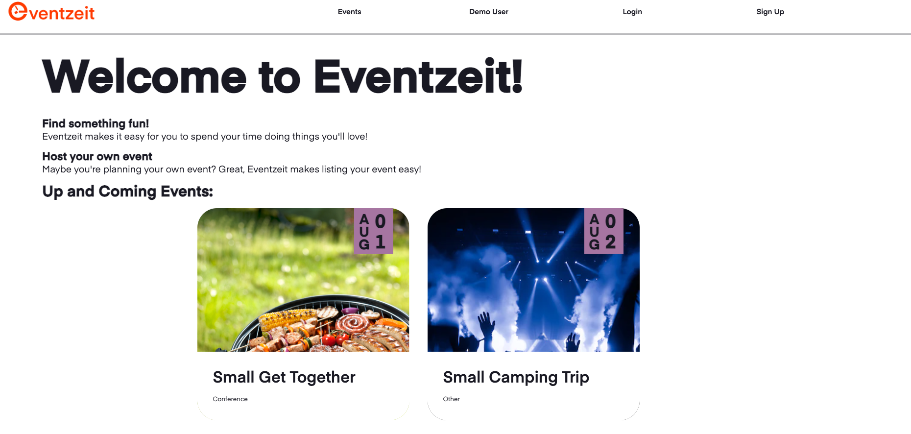
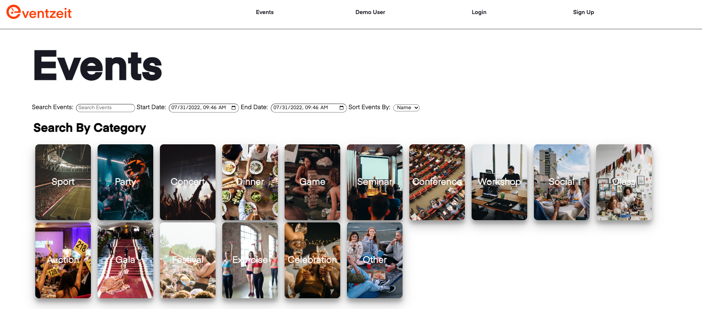
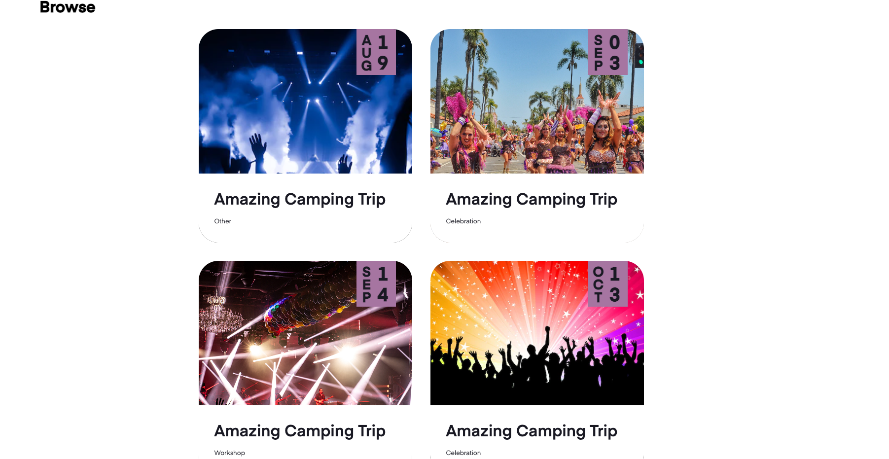
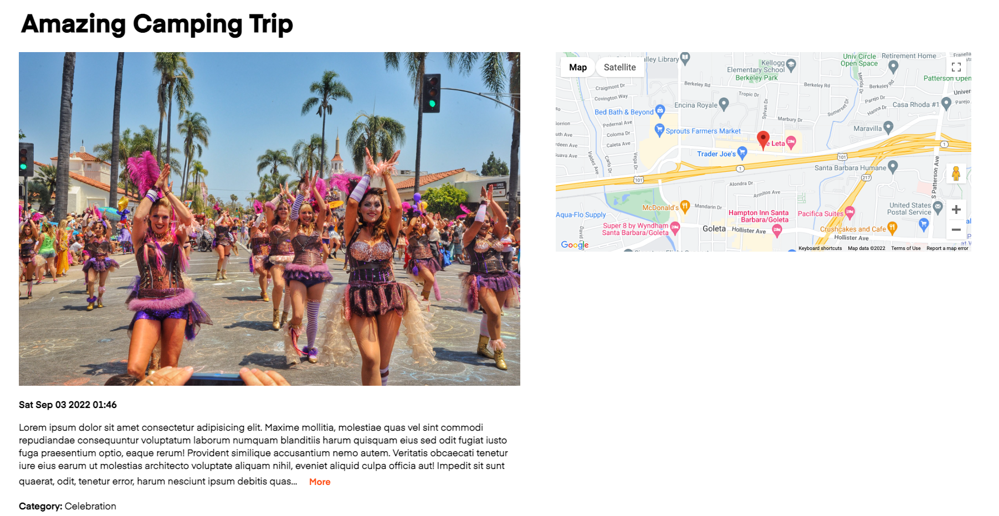
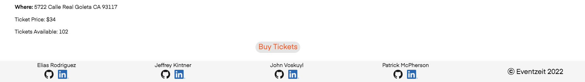
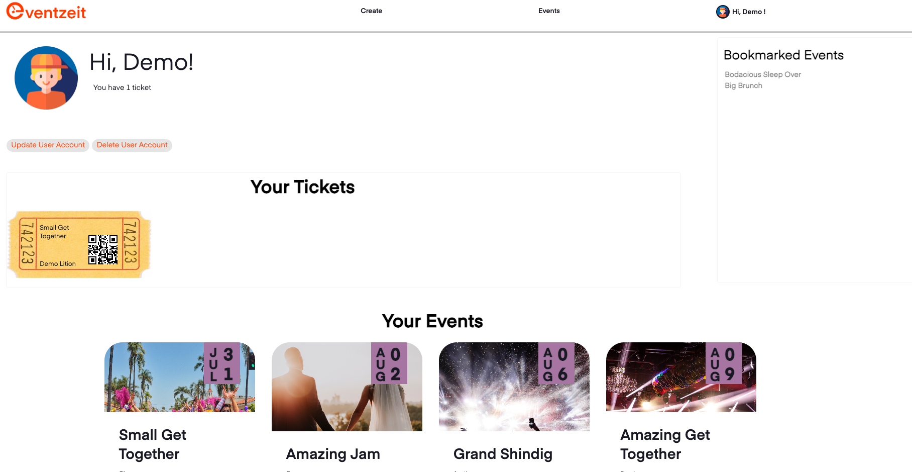

# Eventzeit

---

Welcome to Eventzeit! Eventzeit is a web application build for sharing events, buying tickets for said events and bookmarking events that you may want to buy tickets for in the future.

The project is a clone of Eventbrite and was built using PostgreSQL, Flask, SQLAlchemy, React,javascript, Redux and Python.

Checkout Eventzeit and make it to an event near you at https://eventzeit.herokuapp.com

Add Blocker Warning: If you have an add blocker installed locally, it is possible that you may recieved errors because of the google maps API. We do not have any adds on our site and we ask you to please, temporarly, turn off your add blocker if you are having issues using our site. Thank you for your understanding.

Please Note: We based this project off of this starter https://github.com/Patricus/Eventzeit/tree/starter

### Github Wiki Links:

#### [Features List (Also Listed Below)](https://github.com/Patricus/Eventzeit/wiki/Features-List)

#### [Component File Structure](https://github.com/Patricus/Eventzeit/wiki/Component-File-Structure)

#### [Database Schema](https://github.com/Patricus/Eventzeit/wiki/Database-Schema)

#### [Database Tables](https://github.com/Patricus/Eventzeit/wiki/Database-Tables)

#### [User Stories](https://github.com/Patricus/Eventzeit/wiki/User-Stories)

#### [Redux Store Shape](https://github.com/Patricus/Eventzeit/wiki/Redux-Store-Shape)

#### [API Routes](https://github.com/Patricus/Eventzeit/wiki/API-Routes)

#### [Front End Routes](https://github.com/Patricus/Eventzeit/wiki/Front-End-Routes)

## Splash Page



## Events Page




## Event Details Page




## User Dashboard


## Instructions for Running Locally:

- Pull down the project and make a local copy on your computer from this location: https://github.com/Patricus/Eventzeit
- Set up your database locally:
  - Create a database user with the name and password of your choice
  - Create a database with the name of your choice and make sure that the owner of the database is the database user that you created in the pervious step
- In your root directory run pipenv install
- Add a .env file in your root directory and make sure to add the following items listed below
  ```
  FLASK_APP=app
  FLASK_ENV=development
  SECRET_KEY=<<secret key>>
  DATABASE_URL=postgresql://<<database user>>:<<password>>@localhost/<<database>>
  ```
- cd into the react-app directory and run npm install
- Create a .env file in the root of the react-app directory and add the following code:
  ```
  REACT_APP_BASE_URL=http://localhost:5000
  ```
- In order to get the backend running, make sure you are in the root directory and run the "pipenv shell" command to enter your python shell. Please run "flask db migrate" followed by "flask db upgrade", followed by "flask seed all". Finally we can run the command "flask run" and your backend should start right up, connected to an already seeded database.
- Lastly, open an additional terminal to run you your frontend. cd into react-app and use the command "npm start". This should automatically open up your app on localhost:3000

## Technical Details:

- Event search and category filter was a very exciting feature to implement as no one in our group had an experience doing this before. On the events page a user can search all events listed on the site using a search bar and filter events even further by toggling category buttons. In order to do this, we first implemented useStates for each category in order to have a true of false value to pass through the filter.

```
function Events() {
  const events = Object.values(useSelector(state => state.events));
  const dispatch = useDispatch();
  const [search, setSearch] = useState("");
  const [sport, setSport] = useState(false);
  const [party, setParty] = useState(false);
  const [concert, setConcert] = useState(false);
  const [dinner, setDinner] = useState(false);
  const [game, setGame] = useState(false);
  const [seminar, setSeminar] = useState(false);
  const [conference, setConference] = useState(false);
  const [workshop, setWorkshop] = useState(false);
  const [social, setSocial] = useState(false);
  const [classCategory, setClassCategory] = useState(false);
  const [auction, setAuction] = useState(false);
  const [gala, setGala] = useState(false);
  const [festival, setFestival] = useState(false);
  const [exercise, setExercise] = useState(false);
  const [celebration, setCelebration] = useState(false);
  const [other, setOther] = useState(false);

  useEffect(() => {
    dispatch(acquireEvents());
  }, [dispatch]);

  const checkCategories = event => {
    if (
      !sport &&
      !party &&
      !concert &&
      !dinner &&
      !game &&
      !seminar &&
      !conference &&
      !workshop &&
      !social &&
      !classCategory &&
      !auction &&
      !gala &&
      !festival &&
      !exercise &&
      !celebration &&
      !other
    ) {
      return true;
    }
    if (event.category === "Sport") return sport;
    if (event.category === "Party") return party;
    if (event.category === "Concert") return concert;
    if (event.category === "Dinner") return dinner;
    if (event.category === "Game") return game;
    if (event.category === "Search") return search;
    if (event.category === "Seminar") return seminar;
    if (event.category === "Conference") return conference;
    if (event.category === "Workshop") return workshop;
    if (event.category === "Class") return classCategory;
    if (event.category === "Auction") return auction;
    if (event.category === "Gala") return gala;
    if (event.category === "Festival") return festival;
    if (event.category === "Exercise") return exercise;
    if (event.category === "Celebration") return celebration;
    if (event.category === "Other") return other;
  };

```

- If a category box is checked, the value will be "true" and therefore will pass our filter function. The search feature turns the entered search string into a case insensitive regex expression and uses the match method to check if the value is true or false when searching all potential values in the events list.

```
{events &&
        events
          .filter(event => {
            return checkCategories(event);
          })
          .filter(event => {
            return event.name.match(new RegExp(search, "i"));
          })
          .map(event => {
            return <EventsCard key={event.id} event={event} />;
          })}
```

## Features

## Login and Signup / Demo User

### Create

- Anyone who is not logged in can create a user by signing up

### Read

- Logged in users can check and see their logged in status using the "User Menu" on the right side in the navigator bar

### Update

- Logged in users can change their password, avatar, username or email

### Delete

- Logged in users can delete their own account

## Events

### Create

- Logged in users can create an event

### Read

- Anyone can see all events uploaded to Eventzeit

### Update

- Logged in users can update events they have created

### Delete

- Logged in users can delete the events they have created

## Tickets

### Create

- Logged in users can 'buy' tickets to an event

### Read

- Logged in users can see all of their tickets and the associated events

### Update

- Logged in users can update the ticket attendee name

### Delete

- Logged in users can remove/'sell' a ticket

## Categories

### Read

- Anyone can read a list of categories which aid the user in filtering events

## Bookmark events

### Create

- Logged in users can bookmark events that may want to purchase tickets for in the future

### Read

- Logged in users can read bookmarked events

### Delete

- Logged in users can remove bookmarks on events

## Search

- Filters events by search and/or categories
- Anyone can read the result of their search

## To-Do:

### Google Maps Integration

### Create

Logged in users can link an address/coordinates to their events on the map

### Read

Anyone can see the event address/coordinates on the map

### Delete

Logged in users that have linked an address/coordinates to an event they have created can remove them
